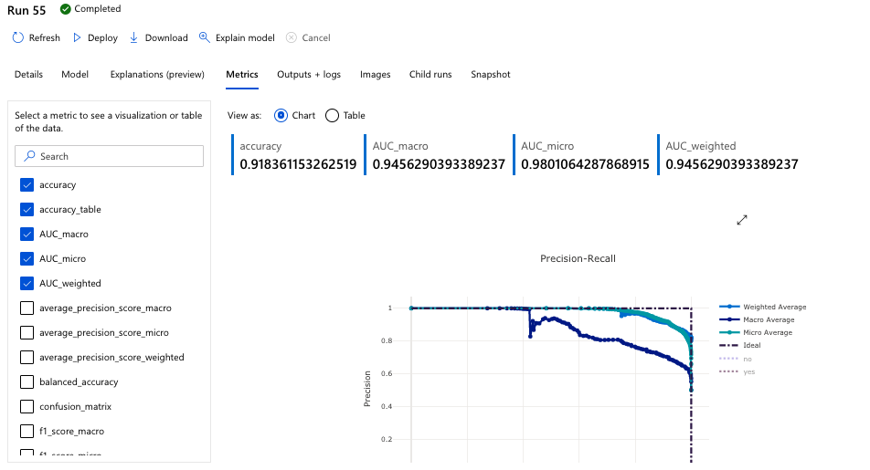
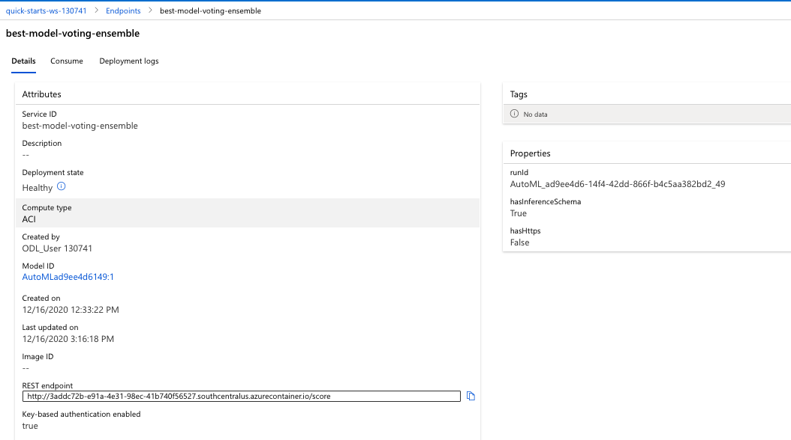
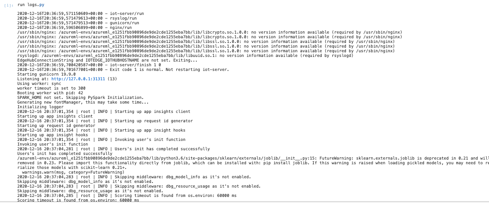
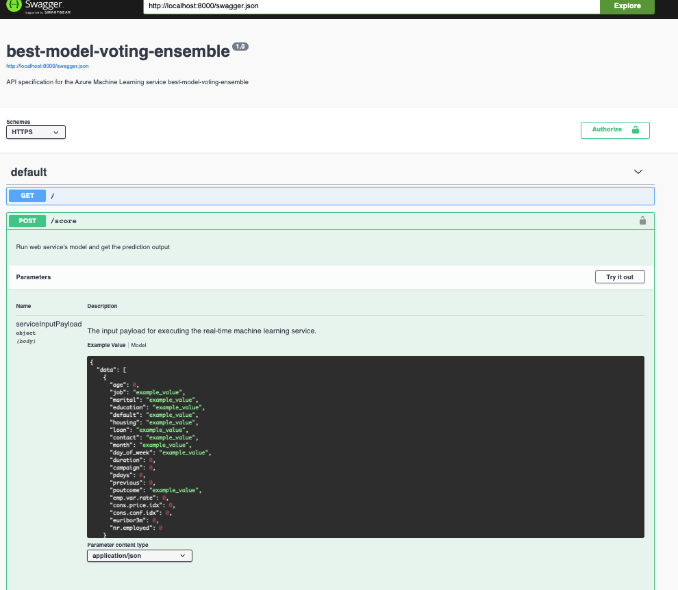
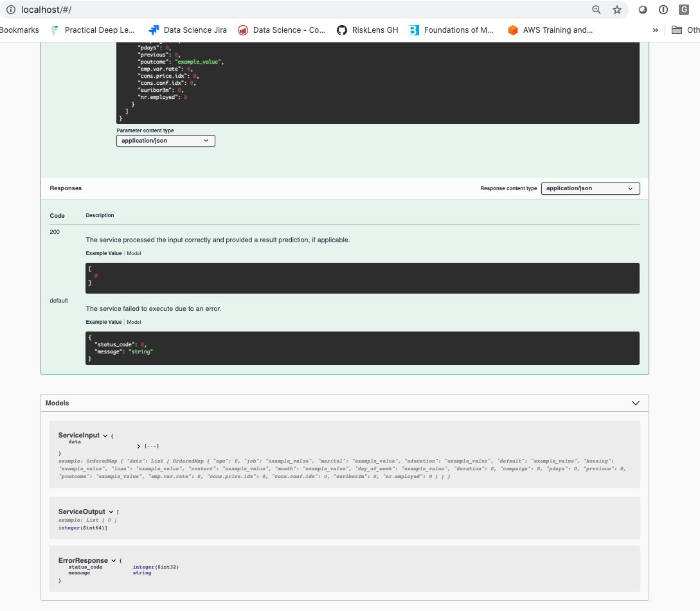
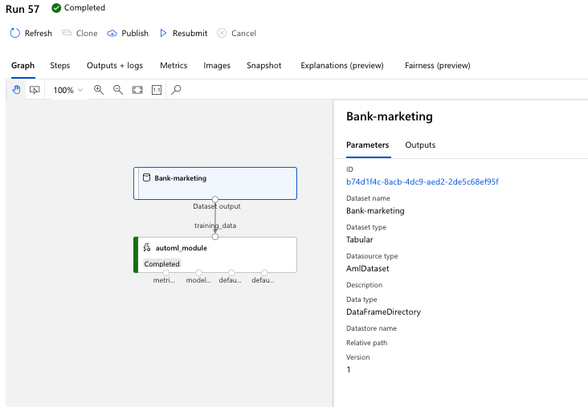

# Azure ML Engineer Nanodegree Project 2

This repo is my project submission for Project #2 of the [Udacity Azure Machine Learning Engineer Nanodegree](https://www.udacity.com/course/machine-learning-engineer-for-microsoft-azure-nanodegree--nd00333).

In this project, we use Azure to configure a cloud-based machine learning production model, deploy it, and consume it. We also create, publish, and consume a pipeline. 

## Architectural Diagram

The following diagram visualizes the key steps of this project, which are then documented in more detail below.

## Key Steps

There were several steps to this project:

### Step 1: Authentication

I actually skipped this step, because I was using a Udacity-provided lab account, and the instructions said we did not have the permissions to do this step on the Udacity-provided labs.

### Step 2: Automated ML Experiment

For this step, I first made sure the proper data set was uploaded and registered in the 
ML Studio:

Then I created a new Automated ML run, which I titled "proj02". Then I set up a new compute cluster, called "proj02-compute". Next I ran the experiment!

The experiment successfully ran:

  

The best model was a "VotingEnsemble" model, with an accuracy of 91.8%:

The ROC curves looked nice too!

### Step 3: Deploy the Best Model

The next step was to select the best model and deploy it using Azure Container Instance. Here is a screenshot of the best model, which I named "best-model-voting-ensemble," deployed as an endpoint:

### Step 4: Enable Logging

Next we updated the `logs.py` code to enable application insights: 

We verify Application Insights was enabled: 

 

And ran the `logs.py` code to get an output of the logs:

 

### Step 5: Swagger Documentation  

Next, I downloaded the `swagger.json` file (available in this repo), ran the `swagger.sh` and `serve.py` code, and interacted with the Swagger documentation. Below are screenshots of the API methods and responses.

  
  

### Step 6: Consume Model Endpoints

Next, we consumed the model endpoints. First we modified the `endpoint.py` script with the URI and key:  

  

Then executed the `endpoint.py` script: 

 

### Step 7: Create, Publish, and Consume a Pipeline

Next, I modified the `aml-pipelines-with-automated-machine-learning-step.ipynb` Jupyter Notebook (see repo) with variables that matched my environment, uploaded the config.json file to the Azure environment, and ran the cells to create a Pipeline in Azure ML Studio. Various screenshots from the process are below:

Pipeline section of ML Studio, showing pipeline has been created: 

Pipeline endpoint: 

Bankmarketing data set in pipeline: 

Published pipeline overview: 

RunDetailsWidget: 

Scheduled run of pipeline via endpoint: 

## Screen Recording

My 4-minute screencast walking through this project may be found at: https://youtu.be/i0yuUdNmfK4 

